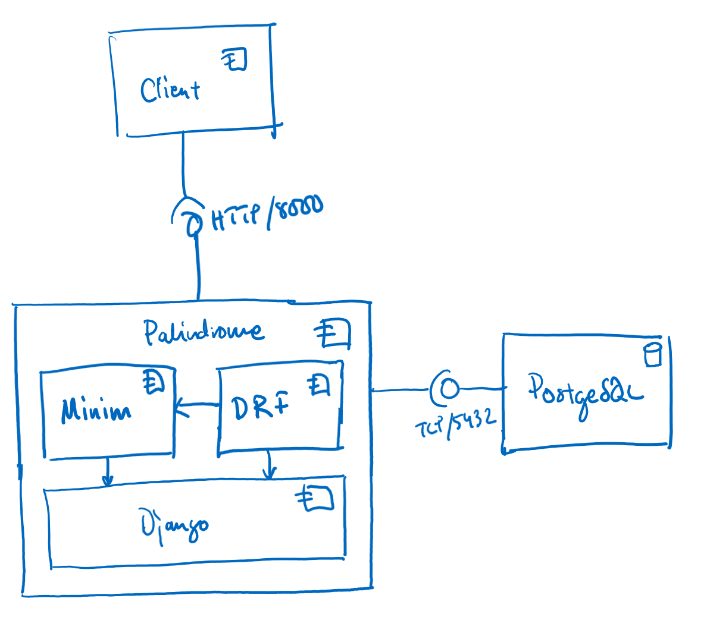
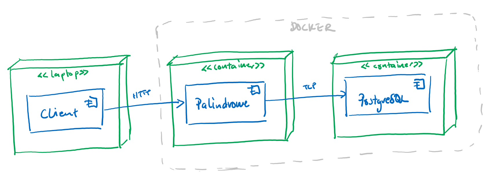
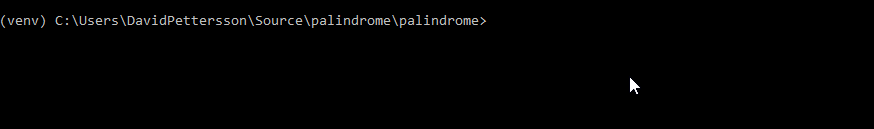

# Palindrome Project

The Palinedrome project is a small microservice that providing a message services with support for identifying
palindrome messages. The application is built in Python and Django, and uses PostgreSQL as its storage backend.

This README contains information that briefly describes the architecture, how to build deploy and test the application
and some basic information describing the web service API.

The repository itself contains:

* **Source Code** for the microservice itself, along with configuration files for building and running Docker images. The source code is available in the `palindrome` subfolder.
* **Documentation** in Sphinx format which elaborates on the project itself, its requirements and the architecture. The documentation is available in the `documentation` subfolder.

## Architectural Overview

The following diagram shows a high-level functional view of the application:



The application is written in Python and uses the Django web framework to manage the heavy-lifting of exposing a web endpoint as well as the nitty-gritty details of database access.

In Django terms, the entire project is called Palindrome, and the application has been named Minim. The project is in the `palindrome` folder, which in turn contains another palindrome folder with the project setting, and the `minim` folder holding the application. 

The Django REST framework library is used to manage tie together the web frontend with the storage backend, while providing a user-friendly interface. Most of this setup is in the `views.py` and `serializer.py` files. 

The palindrome functionality has been implemented through two main functions: `is_strict_palindrome` and `is_relaxed_palindrome` in the `palindrome.py` file.

More details in the architecture description.

## More Documentation

More documentation is available in the Sphinx documentation project. You can generate that documentation my installing Python 3.7 and running the following commands. I am only covering Windows here, so if you are on Linux or Mac, you are on your own (slight modifications necessary).

Enter the documentation folder, and start by creating a virtual environment:

```
py -3 -m venv env
```

Activate the environment:

```
venv\scripts\activate
```

Install the requirements:

```
pip install -r requirements.txt
```

Finally, generate the documentation:

```
make html
```

Your documentation should now be available in the `build\html` folder.

## How to Run

The application has been containerized using Docker and can be run locally using Docker Compose. Due to different deployment routes locally when developing, the `docker-compose.yml` file does not actually build the application image, it only uses it.



First step, from within the palindrome folder, is therefore to build the Docker image:

```
docker build -t palindrome .
```

Once the container is built and put in to the local repository, you can launch it using Docker Compose:

```
docker-compose up
```

This will start a PostgreSQL container, and the recently built application container. The application should be available at http://localhost:8000/api/.

Note that the application container is built in DEBUG mode and without a front-end server. This is not recommended practice, and it has only been left like this to ease testing and development.

## How to Test

The application contains a number of unit tests that make sure that the palindrome functionality works as it supposed to.

These tests are easiest to run outside of the container, but inside a virtual environment, allowing for integration with the IDE for faster turnaround.

From within the palindrome folder, create a virtual environment:

```
py -3 -m venv env
```

Activate the environment:

```
venv\scripts\activate
```

Install the requirements (same as for the container):

```
pip install -r requirements.txt
```

Finally, you can run the unit tests of the Minim application:

```
python manage.py test minin\tests
```

Results should look something like this:

