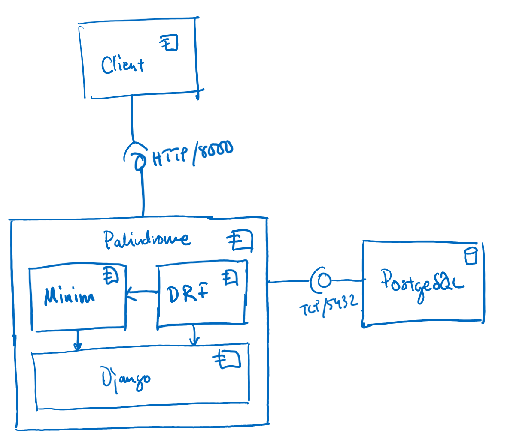

========================
Architecture Description
========================

Introduction
============

The architecture description describes the functionality of the application and also weighs in the different
design decisions that have been made. It consists of a number of views that describe the software in different ways.

This is a very abbreviated architecture description. Scenarios (describing interactions
between different components) and information analysis (describing how different entities are transformed, mean
and should be interpreted) have been omitted due to the application size.

Views
=====

Functional View
---------------

Overview
^^^^^^^^

The following diagram depicts the functional view of the Palindrome application:

Components
^^^^^^^^^^

The following components are a part of this view.

Client
    This is the web service client that uses the web service. It can be a regular web browser, or a dedicated
    client of for the message API.

Palindrome
    Palindrome is the name of the solution itself. It consists of a Django project and is responsible for setting the
    context for the actual web service application. It uses Django's session management for clients, API routing and
    database connection management. It holds the application Minim.

Minim
    Minim is the actual application. It is a typical Django application, and it consists of a number of interaction
    points with the framework, as well as the actual logic for palindrome checks. The data model is represented in
    ``models.py``, the palindrome checking functionality is in ``palindrome.py``, the view interactions are in
    ``views.py`` and so on.

Django REST Framework (DRF)
    Django REST Framework is an extension to Django, that eliminates much of the repetitive work of managing the
    database and serializing/deserializing models for the web interface.

Django
    Django is an open-source web framework for Python. It is commonly used and manages everything from data models
    to web requests. In this project, is is responsible for

PostgreSQL
    PostgreSQL is used as the backing store for Django. It is a relational database engine which is common on the market.

Design Considerations
^^^^^^^^^^^^^^^^^^^^^

Palindrome Checking
    The cost of checking if a message is a palindrome or not is performed once, upon creating or updating messages. The
    rationale for this is to ensure that we do not spend unnecessary CPU cycles processing this on every query made
    to the application.

Django vs Flask
    Django has been selected as the web framework to use, as it is complete with regards to both persistant storage,
    session handling and other plumbing infrastructure. Together with Django REST Framework, it makes the solution
    fairly straightforward. Avoiding writing a lot of boilerplate adds value and minimizes the chances of making
    mistakes for basic CRUD operations.

    Flask has the benefit of being a more lightweight framework, but on the other hand, requires you to manage
    much of the boilerplate yourself, as well as all session and connection management.

    From a project brief perspective, we can assume that the reviewers want to see a demonstation of coding abilities.
    Flask would have produced more bulk code, but it would be much boilerplate, and would not be a demonstration
    of the development skills, more of integration. Unfortunately, the usage of Django does not provide vast amounts
    of code.

PostgreSQL vs other database engines
    PostgreSQL is a rather heavy database. It was selected for portability reasons and (fairly) consistent behaviour
    across platforms. A more efficient and fit-for-purpose database would be a NoSQL document database such as MongoDB.
    However, Django does not support MongoDB out of the box, and more libraries would have needed to be integrated to
    support the usage of this (or other) databases.

Development View
----------------

Overview
^^^^^^^^

Development of the application is done on local development machines. The main requirement is that the development
machine support running Python 3.7 and Docker, as they are two key components. This should allow for most major
operating systems.

Development Tools
^^^^^^^^^^^^^^^^^

Developer's may use any editor they wish. The implementation will come with IntelliJ project files that should be
reusable for most developers. Python is indentation sensitive, so the recommendation is that the editor have

Coding Standards
^^^^^^^^^^^^^^^^

For code formatting, the application must align with PEP 8 (Style Guide for Python Code). No other code formatting
requirements exist beyond what is syntactically necessary.

Testing
^^^^^^^

Unit testing is mandatory for custom logic. Unit tests should align with the Django framework for testing. Unit
testing is not required for configuration and wiring code. This should be tested using system/acceptance tests.

Deployment View
---------------

Overview
^^^^^^^^

The following diagram depicts the deployment view of the Palindome project:

.. image:: deployment-view.png

Components
^^^^^^^^^^

There are three main nodes in the application.

Laptop
    Represents the node that runs the client. In this case it is a laptop as that has been the main client platform.

Containers for Palindrome and PostgreSQL
    Both Palindrome and PostgreSQL have been containerized. Palindrome has its own Docker container definition, while
    PostgreSQL is running in an official Docker container. Both of them have been running in Docker for Desktop during
    development, but are deployable to other container services such as Kubernetes.

Design Considerations
^^^^^^^^^^^^^^^^^^^^^

Horizontal Scaling
    Horizontal scaling might be needed in the future if the load increases. Additional application instances can
    easily be added, allowing for more clients to be supported. The database will not scale as easily, and will
    require more work before supporting horizontal scaling.

Vertical Scaling
    Both the application and database containers will support vertical scaling to a limited degree. The application
    container will most likely hit the scaling roof first as Python inherently is a single-threaded execution platform.
    Vertical scaling can be achieved by putting a frontend server in front of it, and using the WSGI interface. The
    database container will likely handle vertical scaling much better as it support multithreading.

Containerization of Database Server
    Using an official PostgreSQL container allows for easy deployment of the database with a minimum of hassle. PostgreSQL
    has a fairly large footprint though, so if better efficiency would be needed, another database server should be
    selected.

